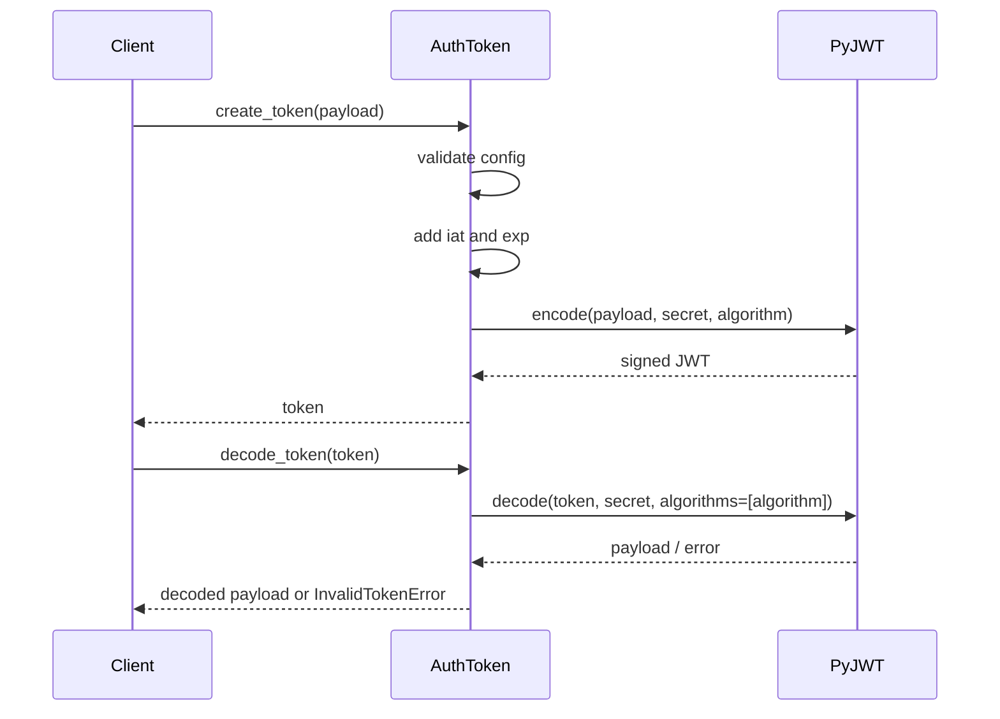

# Auth Token Layer

This module provides a small JWT-based authentication utility for generating and validating signed tokens. It exposes a helper to obtain a secure application secret and an `AuthToken` class that encapsulates token configuration such as secret, expiration time, and signing algorithm. When creating a token, the class merges caller-provided payload data with standard JWT time claims (`iat` and `exp`) and signs the result using PyJWT. When decoding, it validates the token signature and expiration using the configured secret and algorithm, then returns the decoded payload. The module also performs input validation for configuration values like secret length, allowed algorithms, and expiration duration, raising domain-specific exceptions for invalid input or invalid tokens.

## Purpose

The goal of this module is to centralize JWT token handling for authentication or session-like workflows. It exists to simplify secure token creation and verification while enforcing a few basic safety rules: strong secrets, supported algorithms, and positive expiration times. This helps the broader application avoid duplicating token logic and provides a consistent interface for issuing and validating authentication tokens.

## Architecture

```mermaid
flowchart TD
    A[Caller / Auth Service] --> B[AuthToken]
    B --> C[_generate_app_secret]
    B --> D[create_token(data)]
    B --> E[decode_token(token)]
    D --> F[datetime/timezone]
    D --> G[PyJWT encode]
    E --> H[PyJWT decode]
    C --> I[secrets.token_bytes]
    C --> J[base64.urlsafe_b64encode]
    B --> K[Custom Errors\nTokenInputError / InvalidTokenError]
```



## Tech Stack

- Python: Core implementation language for token utilities.
- PyJWT (`jwt`): Handles JWT encoding, decoding, signature verification, and expiration validation.
- `datetime` / `timezone` / `timedelta`: Used to generate UTC-aware issue and expiration timestamps.
- `secrets`: Generates cryptographically secure random bytes for fallback secret creation.
- `base64`: Encodes random secret bytes into a URL-safe string representation.
- Custom exception module (`auth_token_errors`): Provides domain-specific error types for clearer failure handling.

## Key Components

- `DEFAULT_EXPIRATION`, `MIN_SECRET_LENGTH`, `DEFAULT_ALGORITHM`, `ALLOWED_ALGORITHMS`: Module-level configuration defaults and constraints.
- `_generate_app_secret(user_secret=None)`: Internal helper that either accepts a sufficiently strong user-provided secret or generates a secure random base64-encoded secret.
- `AuthToken.__init__(secret, minutes, algorithm)`: Validates token manager configuration and stores the secret, expiry duration, and signing algorithm.
- `AuthToken.create_token(data)`: Builds a JWT payload by combining caller data with `iat` and `exp`, then signs it.
- `AuthToken.decode_token(token)`: Verifies token structure, signature, and expiry, then returns the decoded payload.
- `TokenInputError`: Used for invalid configuration or token creation input.
- `InvalidTokenError`: Used for invalid, empty, malformed, expired, or undecodable tokens.

## Error Handling

The module uses explicit validation and custom exceptions to separate configuration/input problems from token validation failures. During initialization, invalid algorithm types, unsupported algorithms, non-integer expiration values, non-positive expiration values, and weak or non-string secrets raise `TokenInputError`. During token creation, any unexpected encoding failure is wrapped as `TokenInputError` with context. During decoding, the method first checks that the token is a non-empty string; if not, it raises `InvalidTokenError`. Any decode-related exception from PyJWT or other runtime issues is normalized into `InvalidTokenError`, giving callers a single error type to catch for verification failures. One implementation detail worth noting is that decode errors are broadly caught and wrapped, which simplifies caller handling but may hide more granular JWT failure categories such as expired vs malformed tokens.

