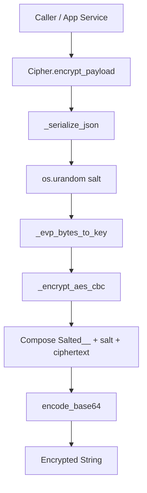
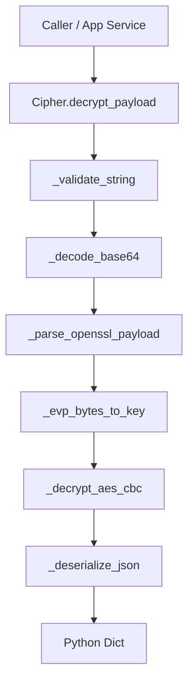
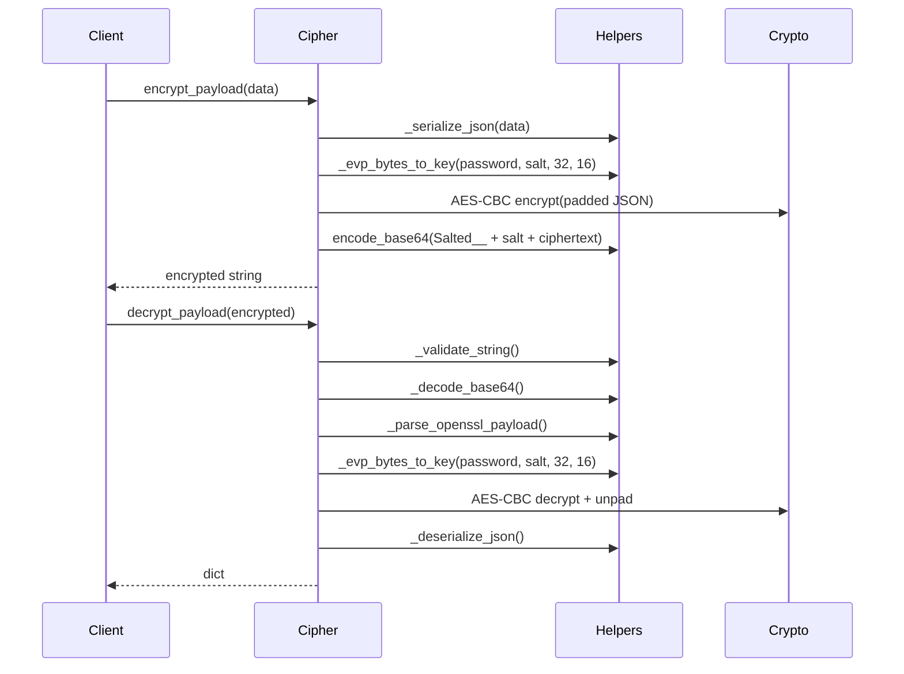

# Encryption Layer

This module provides a small encryption/decryption utility for JSON payloads using AES-256-CBC in an OpenSSL/CryptoJS-compatible format. It accepts a string password, derives an AES key and IV using the legacy OpenSSL EVP_BytesToKey algorithm with MD5 and an 8-byte salt, then encrypts serialized JSON data into a payload formatted as `base64("Salted__" + salt + ciphertext)`. For decryption, it performs the reverse flow: validate the input string, base64-decode it, verify the OpenSSL `Salted__` header, extract the salt and ciphertext, derive the same key/IV, decrypt with AES-CBC, remove PKCS#7 padding, and parse the resulting UTF-8 JSON back into a Python dictionary.

## Purpose

The module exists to securely exchange structured JSON data with systems that use the common OpenSSL/CryptoJS salted AES-CBC format. Its main goal is compatibility: it makes it easy for the backend to encrypt Python dictionaries into a format that frontend code or external tools can decrypt, and to decrypt payloads produced by those systems back into Python objects.

## Architecture

## Tech Stack

- Python: Core implementation language for the encryption helper.
- PyCryptodome (`Crypto.Cipher.AES`, `Crypto.Util.Padding`): Performs AES-CBC encryption/decryption and PKCS#7 padding/unpadding.
- `hashlib` (MD5): Implements OpenSSL-compatible EVP_BytesToKey derivation.
- `base64`: Encodes and decodes the transport-safe encrypted payload.
- `json`: Serializes Python dictionaries to UTF-8 JSON and deserializes them back.
- `os.urandom`: Generates cryptographically random 8-byte salts.
- Custom exception module (`cipher_errors`): Provides domain-specific errors such as `EncryptionError`, `DecryptionError`, `InvalidEncryptedData`, `InvalidEncryptionKey`, and `EVP_BytesToKeyError`.

## Key Components

- `Cipher` class: Main public interface. Stores the password and exposes `encrypt_payload` and `decrypt_payload`.
- `_evp_bytes_to_key(...)`: Key derivation helper that reproduces OpenSSL/CryptoJS password-based key and IV generation.
- `_validate_string(...)`: Guards against empty or invalid encrypted string input.
- `_decode_base64(...)` / `encode_base64(...)`: Handle conversion between raw bytes and transport-safe base64 strings.
- `_parse_openssl_payload(...)`: Validates the `Salted__` header and extracts the salt and ciphertext.
- `_encrypt_aes_cbc(...)`: Encrypts padded plaintext using AES-CBC.
- `_decrypt_aes_cbc(...)`: Decrypts ciphertext and removes padding, rejecting malformed ciphertext.
- `_serialize_json(...)` / `_deserialize_json(...)`: Convert between Python dictionaries and UTF-8 JSON bytes.
- Module constants (`SALT_PREFIX`, `SALT_SIZE`, `AES_KEY_SIZE`, `AES_BLOCK_SIZE`, `MIN_LENGTH`): Define the OpenSSL payload structure and cryptographic sizes used throughout the module.

## Error Handling

The module uses explicit, domain-specific exceptions to separate validation errors from operational failures. Input validation catches empty keys, malformed encrypted strings, invalid payload headers, invalid ciphertext sizes, bad padding, and invalid JSON. Low-level failures in key derivation are wrapped as `EVP_BytesToKeyError`; malformed or corrupted encrypted content raises `InvalidEncryptedData`; unexpected decrypt failures are wrapped as `DecryptionError`; and encryption/serialization failures are wrapped as `EncryptionError`.

Notable details:
- `decrypt_payload` preserves `InvalidEncryptedData` and `EVP_BytesToKeyError` directly, and wraps everything else in `DecryptionError`.
- `encrypt_payload` preserves `EncryptionError` and `EVP_BytesToKeyError`, and wraps other exceptions in `EncryptionError`.
- The design is defensive, validating format and structure before cryptographic operations.
- There are a couple of implementation inconsistencies to be aware of:
  - `_encrypt_aes_cbc` creates `EncryptionError(e)` in the `except` block but does not `raise` it, which may lead to `None` being returned instead of an exception.
  - `_serialize_json` raises `InvalidEncryptedData` on serialization failure, but semantically this would be more appropriate as `EncryptionError`.
  - `_decode_base64` claims strict validation, but `base64.b64decode(data)` is used without `validate=True`, so some malformed input may not be rejected as strictly as intended.

