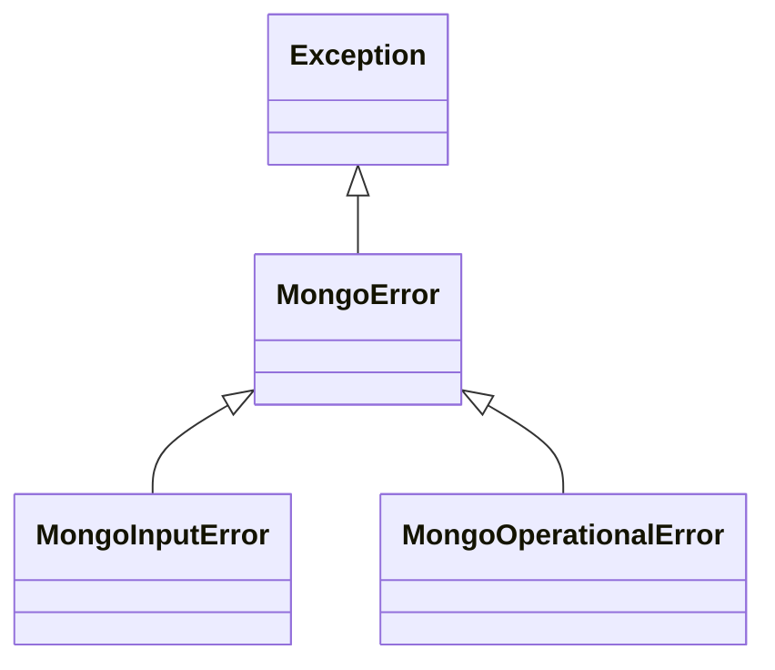
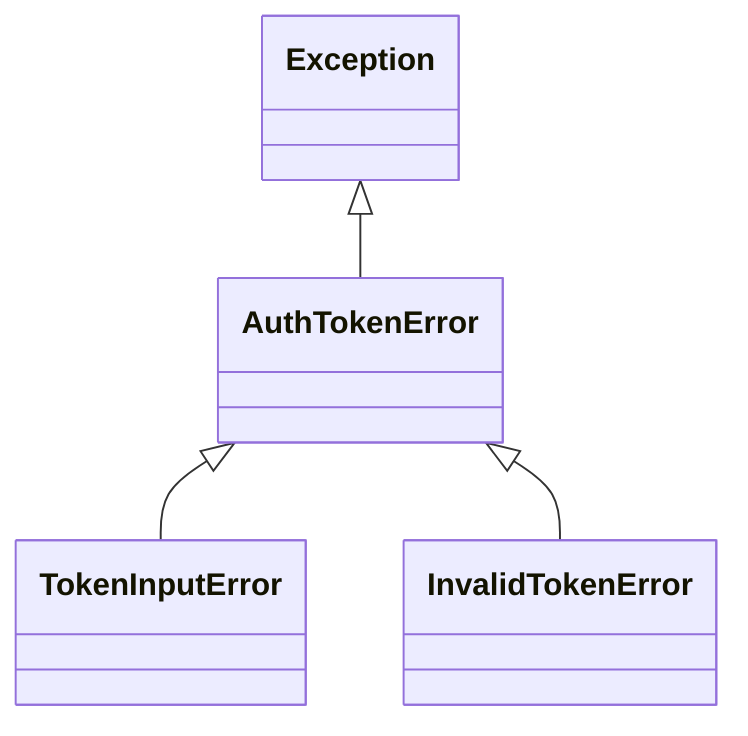
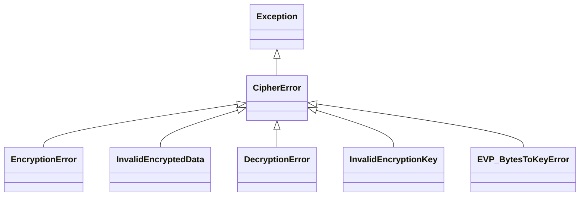

# Error Handling

This document describes how errors are structured, raised, and returned across the backend.

The system uses a **layered error handling approach**, where each subsystem defines its own errors, and all errors are normalized before being returned to the client.

## Error Handling Strategy

Errors are handled in three stages:

1. **Raised** within a specific layer (Mongo or Security)
2. **Caught** in the WebSocket handler (`mongo_websocket.py`)
3. **Normalized** into a consistent response format for the client

## Main Errors

## Mongo Errors

Custome exceptions hierarchy for MongoDB-related operations.

**Exceptions**
- **MongoError**: All MongoDB exceptions
  - **MongoInputError**: Raised when input parameters are invalid or missing.
  - **MongoOperationalError**: Raised when an unexpected error occurs during MongoDB operations.

**Hierarchy**

## Mongo Errors

Custome exceptions hierarchy for MongoDB-related operations.

**Exceptions**
- **MongoError**: All MongoDB exceptions
  - **MongoInputError**: Raised when input parameters are invalid or missing.
  - **MongoOperationalError**: Raised when an unexpected error occurs during MongoDB operations.

**Hierarchy**

## AuthToken Errors

Custome exceptions hierarchy for JWT Token operations.

**Exceptions**
- **AuthTokenError**: All authentication token exceptions
  - **TokenInputError**: Raised when input parameters are invalid or missing..
  - **InvalidTokenError**: Raised when a token is expired, invalid, or cannot be parsed.

**Hierarchy**

## Cipher Errors

Custome exceptions hierarchy for cipher-related operations.

**Exceptions**
- **CipherError**: All cipher-related exceptions
  - **EncryptionError**: Raised when encryption failures occur.
  - **InvalidEncryptedData**: Raised when encrypted input is malformed or invalid.
  - **DecryptionError**: Raised when decryption fails.
  - **InvalidEncryptionKey**: Raised when the encryption key is invalid.
  - **EVP_BytesToKeyError**: Raised when evp_bytes to key convertion fails.

**Hierarchy**

