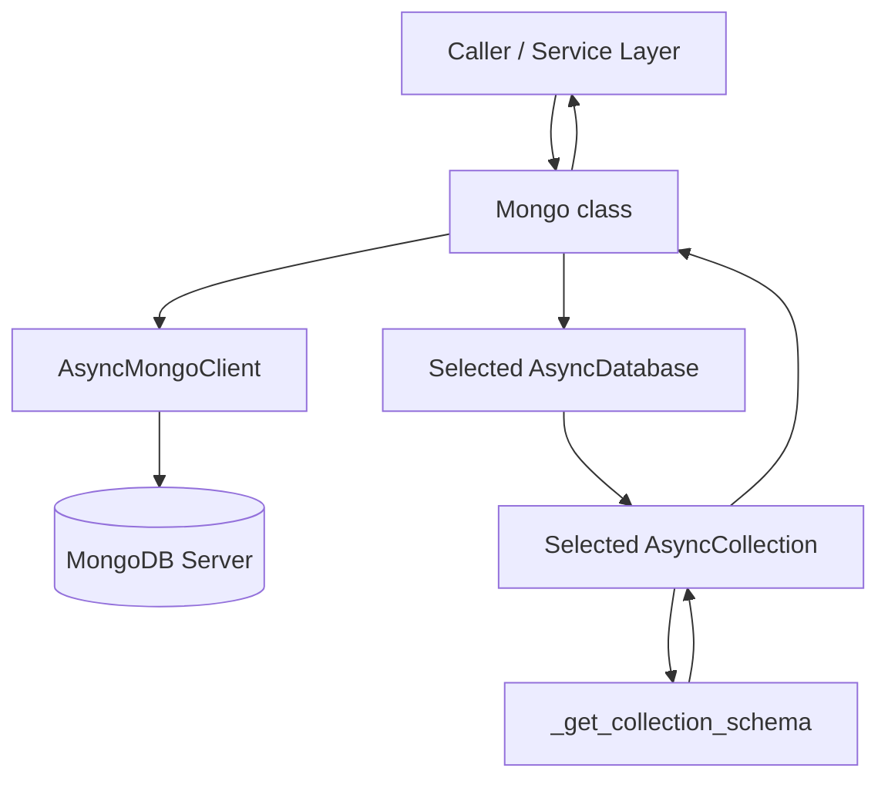
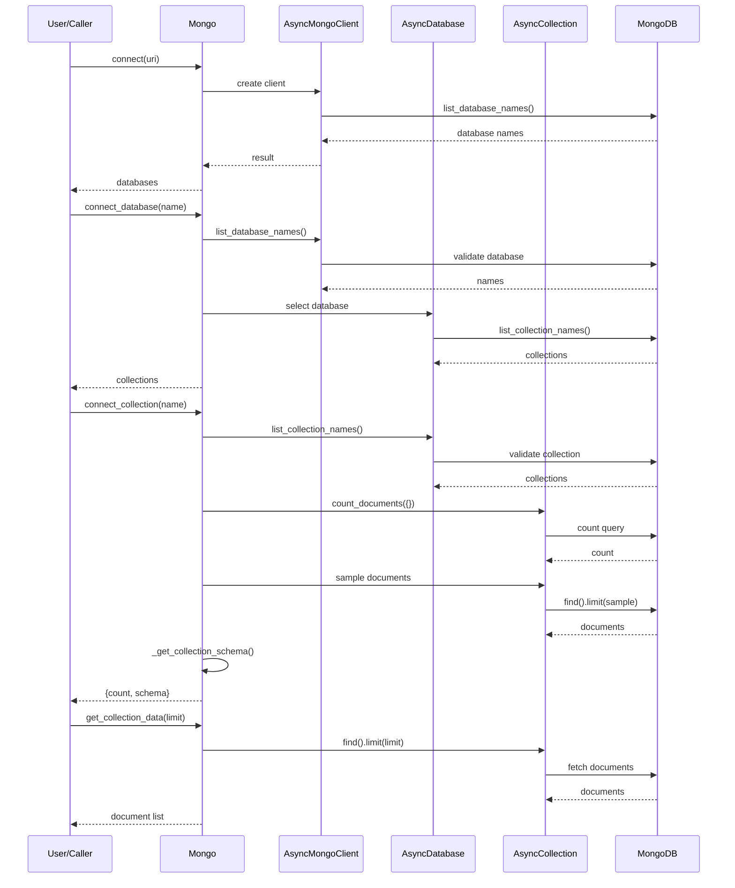

# Mongo Layer

This module provides an asynchronous wrapper around MongoDB operations using PyMongo’s async client. It manages connection lifecycle, database selection, collection selection, lightweight schema inference, and document retrieval. Internally, it stores connection state on a `Mongo` class instance and exposes high-level async methods to connect to a server, reconnect, choose a database, inspect a collection, and fetch collection data. It also normalizes failures into custom domain-specific exceptions (`MongoInputError` for validation/state issues and `MongoOperationalError` for runtime/driver failures).

## Purpose

The module exists to simplify common MongoDB access patterns behind a small stateful service interface. Instead of requiring callers to directly manage async PyMongo clients, selected databases, selected collections, and repeated validation, it centralizes those concerns. Its main goal is to provide a safer, cleaner API for browsing MongoDB servers and reading collection metadata/data while giving consistent error semantics to the rest of the application.

## Architecture

## Tech Stack

- **Language**: Python — implements the async wrapper and state management.
- **Database Driver**: `pymongo` async API (`AsyncMongoClient`, `AsyncDatabase`, `AsyncCollection`) — handles non-blocking communication with MongoDB.
- **Database**: MongoDB — stores databases, collections, and documents queried by the module.
- **Error Abstraction Layer**: custom exceptions from `.mongo_errors` — converts low-level driver/runtime failures into application-specific errors.
- **Utilities**: `collections.defaultdict` — aggregates observed field types during schema inference.
- **Typing Layer**: `typing` primitives (`List`, `Dict`, `Any`, `Optional`) — improves clarity of the public API and expected return types.

## Key Components

- **`Mongo` class**: Main stateful service object. Holds URI, selected database/collection names, and active PyMongo client/database/collection handles.
- **`connect(uri)`**: Validates and opens a MongoDB connection, returning available database names.
- **`reconnect()`**: Reuses the stored URI to restore connectivity if the current client is unavailable.
- **`check_connection()`**: Uses a `ping` command to verify whether the current client is alive.
- **`connect_database(database)`**: Validates that a database exists, selects it, and returns its collection names.
- **`connect_collection(collection)`**: Validates that a collection exists in the selected database, selects it, returns document count and inferred schema.
- **`get_collection_data(limit=None)`**: Reads documents from the selected collection, optionally limiting result size.
- **`close_connection()`**: Closes the client and resets all in-memory state.
- **`_get_collection_schema(collection, sample_size)`**: Helper function that samples up to `SAMPLE_SIZE` documents and builds a lightweight schema mapping field names to observed Python type names.
- **State reset helpers**: `_reset_database_state()` and `_reset_all_state()` ensure internal state remains consistent when changing connection scope or closing the client.

## Error Handling

The module uses a two-level error-handling strategy:

- **Input/state validation errors** are raised as `MongoInputError`. These include empty URI/database/collection names, attempts to select resources before connecting, and selecting non-existent databases or collections.
- **Operational/runtime failures** are wrapped as `MongoOperationalError`. These include failures during connection, schema inspection, closing the client, collection selection, and document retrieval.
- **Connection-specific handling**: `ServerSelectionTimeoutError` is explicitly translated into a user-friendly `MongoInputError` indicating an invalid URI or unreachable server.
- **Health checks**: `check_connection()` catches `PyMongoError` and returns `False` instead of raising, allowing callers to treat connection verification as a boolean status check.
- **Exception chaining**: most wrapped exceptions use `raise ... from e`, preserving the original cause for debugging.
- **Potential gap**: `get_collection_data()` documents that `limit` must be valid, but it does not explicitly validate `limit >= 1`; invalid values may be left to PyMongo or produce unintended behavior. Also, broad `except Exception` blocks make the API consistent but may hide some lower-level details unless logs are added upstream.

