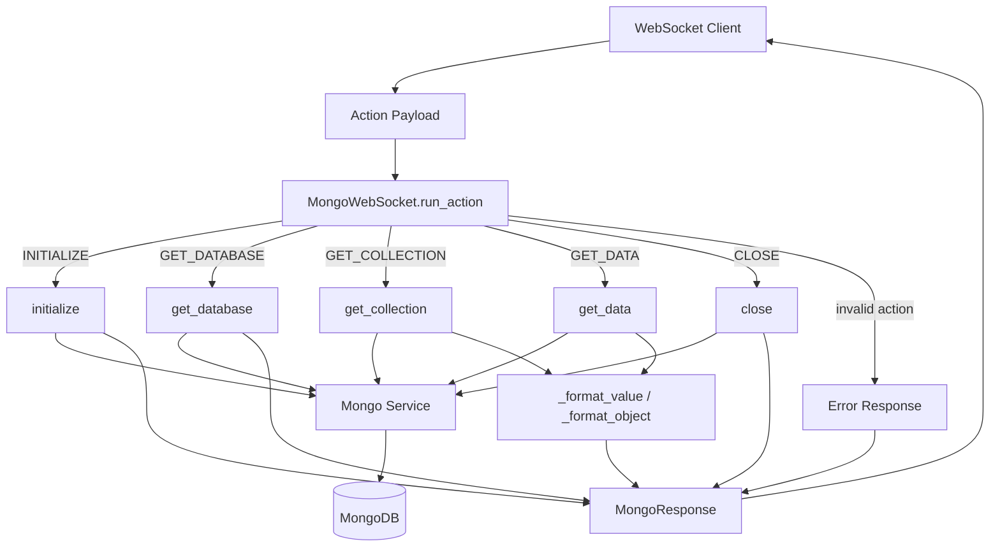
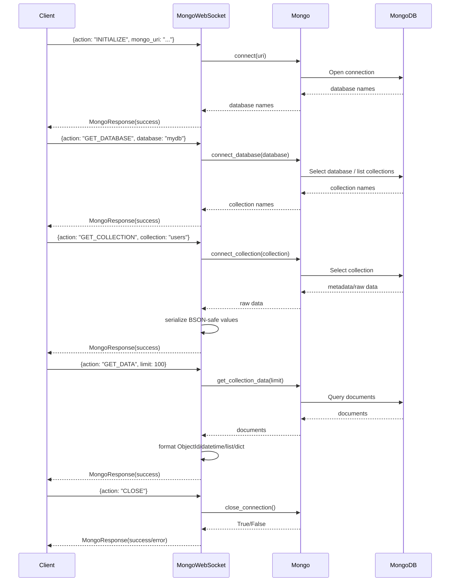

# MongoWebSockets

This module provides an asynchronous WebSocket-oriented action handler for interacting with MongoDB in a controlled, JSON-safe way. It acts as a thin orchestration layer between incoming client action payloads and a lower-level `Mongo` service. The handler supports initializing a MongoDB connection, selecting a database, selecting a collection, retrieving collection data, and closing the connection. It also normalizes MongoDB-native types such as `ObjectId` and `datetime` into JSON-serializable values so results can be safely sent over WebSocket or other API transports.

## Purpose

The module exists to expose MongoDB operations through a simple action-based interface suitable for WebSocket communication. Its main goal is to let clients browse MongoDB structure and data interactively without directly managing database driver behavior. It solves three key problems: dispatching user-requested actions to the right Mongo operation, validating basic input before execution, and transforming MongoDB-specific values into response-safe structures.

## Architecture

## Tech Stack

- Python: Core implementation language for the WebSocket action handler.
- Async/await: Used for non-blocking database operations and request handling.
- MongoDB: Backing datastore being explored and queried.
- BSON / `ObjectId`: MongoDB-native identifier type handled during serialization.
- `datetime`: Standard Python temporal type converted to ISO strings for transport.
- Internal `Mongo` service: Encapsulates direct database connection and query logic.
- Internal `MongoResponse` model: Standardized response envelope for success and error replies.
- Internal `MongoInputError`: Custom validation error used to distinguish client input problems from other failures.
- WebSocket integration pattern: Although the socket transport itself is not implemented here, the module is designed to receive action payloads and return response objects suitable for WebSocket APIs.

## Key Components

- `MongoWebSocket`: Main coordinator class. Holds a `Mongo` instance and an action-to-handler dispatch table.
- `_actions`: Dictionary mapping action constants (`INITIALIZE`, `GET_DATABASE`, `GET_COLLECTION`, `GET_DATA`, `CLOSE`) to the corresponding async methods.
- `run_action(payload)`: Entry point for processing client requests. Extracts the `action` field, resolves the handler, and returns a standardized error for unsupported actions.
- `initialize(payload)`: Validates `mongo_uri`, opens the Mongo connection through the `Mongo` service, and returns available database names.
- `get_database(payload)`: Validates a database name, selects the database, and returns its collection names.
- `get_collection(payload)`: Validates a collection name, selects it, and returns serialized collection metadata or collection-related raw data.
- `get_data(payload)`: Validates optional `limit`, enforces a maximum cap (`MAX_LIMIT = 1000`), fetches documents, and serializes them into JSON-safe dictionaries.
- `close()`: Closes the active Mongo connection and returns success or failure status.
- `_success(action, data)`: Produces a consistent `MongoResponse` success envelope.
- `_error(action, message)`: Produces a consistent `MongoResponse` error envelope with `error_message`.
- `_format_value(value)`: Recursive serializer for MongoDB/Python values. Converts `ObjectId` to string, `datetime` to ISO 8601 string, `bytes` to decoded strings, and walks nested dict/list structures.
- `_format_object(item)`: Helper to serialize every field in a MongoDB document dictionary.
- Constants: Action names and `MAX_LIMIT` provide a small command protocol and guardrails for queries.

## Error Handling

The module uses a simple, consistent error-handling strategy centered around returning structured `MongoResponse` objects instead of raising exceptions to callers. Input validation errors are explicitly detected and raised as `MongoInputError`, then converted into user-friendly error responses. General runtime exceptions are also caught and returned as error responses, preventing crashes in the WebSocket request loop.

Key behaviors:
- Invalid or missing inputs are checked before calling the `Mongo` service:
  - `mongo_uri` must be a non-empty string.
  - `database` must be a non-empty string.
  - `collection` must be a non-empty string.
  - `limit` must be an integer greater than 0 if provided.
- `limit` is capped at `MAX_LIMIT` to reduce risk from oversized reads.
- Unknown actions in `run_action` return a standardized `Invalid action` error.
- Serialization helpers reduce transport issues by converting MongoDB-native values into JSON-safe forms.
- The `close` flow treats a falsey close result as an operational error and returns a message instead of assuming success.

One implementation note: `close` is registered in `_actions` but its signature does not accept a `payload`, while `run_action` invokes handlers as `await handler(payload)`. In its current form, dispatching `CLOSE` through `run_action` may raise a function-argument error, which is then returned as an error response only if routed differently. This is an architectural mismatch worth fixing by changing `close` to accept an optional payload or wrapping it in a lambda.

