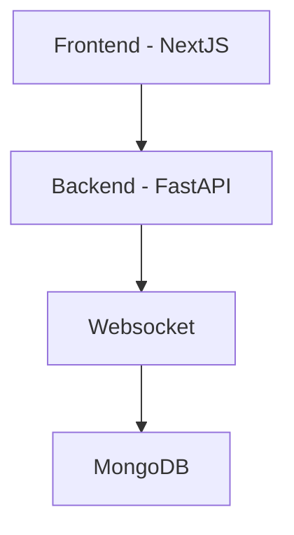

# App Overview – MONGO OPS

Access and view your MongoDB using your uri

## Architecture Diagram

Include a diagram showing how components communicate. You can use ASCII, draw.io, Miro, or Mermaid diagrams.

---

## Tech Stack

| Layer          | Technology   | Purpose                     |
| -------------- | ------------ | --------------------------- |
| Frontend       | NextJS        | User interface              |
| Backend        | FastAPI      | API server & business logic |
| Database       | MongoDB      | Data storage                |
| Authentication | JWT  | Secure access               |

---

## Key Components / Modules

### Frontend

- Pages: Home
- Components: Loader, Input boxes, Data Table

### Backend

- API Routes: `/auth`, `/ws/mongo`,
- Services: Mongo handlers, Security handlers.
- Utilities: Logging, error handling, middleware

### Database

- Connects to mongo db

---

## Environment & Config

### Backend

| ENV | Format | Discription | Example |
| --- | --- | --- | --- |
| `ENCRYPTION_KEY` | 32 byte hex | Key for encripting api payload. | `tMh53JhX+NiHVfRnwAtopNJiCFSsA3qb8P8FNgYgiEU=`|
| `JWT_SECRET_KEY` | 32 byte hex | Key for encription jwt. | `tMh53JhX+NiHVfRnwAtopNJiCFSsA3qb8P8FNgYgiEU=`|
| `JWT_ALGORITHM` | jwt algorithm identifier  | Algorithm to use to encript jwt. | `HS256`|
| `EXPIRE_MINUTES` | Number of minutes  | Number of minutes until jst expire | `30`|
| `ALLOWED_ORIGINS` | host  | hosts allow to access api | `http://localhost:3000,http://localhost:3001`|

### Frontend

| ENV | Format | Discription | Example |
| --- | --- | --- | --- |
| `AUTH_SECRET` | 32 byte hex | NextAuth secret. | `tMh53JhX+NiHVfRnwAtopNJiCFSsA3qb8P8FNgYgiEU=`|
| `AUTH_URL` | host | Base URL for all requests. | `http://localhost:3000`|
| `NEXT_PUBLIC_ENCRYPTION_KEY` | Same key as backends `ENCRYPTION_KEY` | Key to decript payload from api | `tMh53JhX+NiHVfRnwAtopNJiCFSsA3qb8P8FNgYgiEU=`|

---

## Security & Authentication

- Authentication method: JWT / Session Cookies
- Input validation and sanitization

---

## Logging & Monitoring

- Logging framework: Python `logging` module, log levels
- Health check endpoint: `/health`

---

## Error Handling

- Custome exceptions
- HTTP exceptions

---

## Future Improvements / Roadmap

- Add, Edit, and Delete data

---

